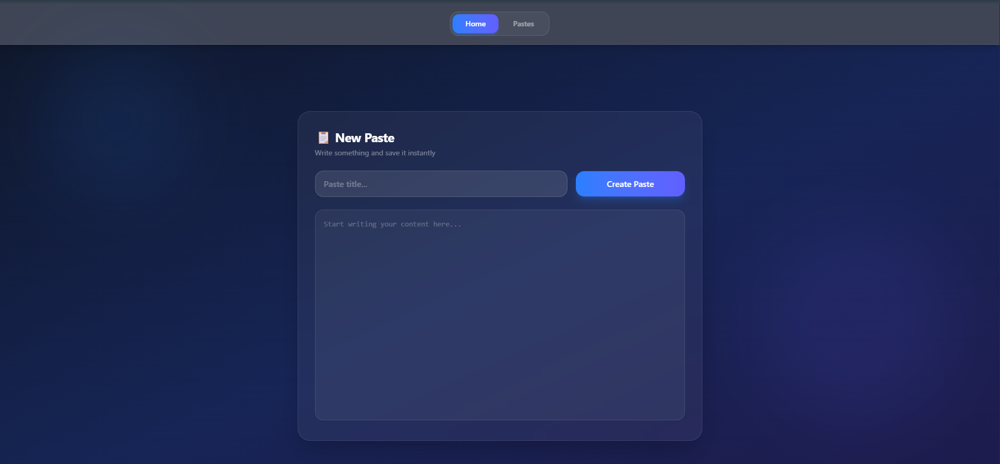

# PasteApp 📋

A modern paste manager built with React and Redux. Create, edit, view, copy, share, and delete pastes — all stored locally in your browser. Clean glassmorphism UI with instant search.

## Live Demo

[Click here to view](https://Samiullah-2004.github.io/paste-app/)

---

## Preview



---

## Features

- Create and save pastes instantly
- Edit existing pastes
- View pastes in read-only mode
- Copy paste content to clipboard with one click
- Share paste links instantly
- Delete pastes
- Search through all pastes in real time
- Data persists via Redux + LocalStorage
- Clean glassmorphism dark UI

---

## Tech Stack

| Technology | Purpose |
|---|---|
| React | UI and components |
| Redux Toolkit | Global state management |
| React Router | Page navigation |
| Tailwind CSS | Styling and dark theme |
| Vite | Build tool and dev server |

---

## Project Structure

```
paste-app/
│
├── public/
│   └── favicon.svg          # Browser tab icon
├── src/
│   ├── components/
│   │   ├── Home.jsx         # Create and edit pastes
│   │   ├── Pastes.jsx       # View and manage all pastes
│   │   ├── Viewpaste.jsx    # Read-only paste view
│   │   └── Navbar.jsx       # Navigation bar
│   ├── redux/
│   │   ├── store.js         # Redux store setup
│   │   └── pasteslice.js    # Paste actions and reducers
│   ├── App.jsx              # Routes setup
│   └── main.jsx             # App entry point
├── index.html               # HTML entry point
├── tailwind.config.js       # Tailwind configuration
├── vite.config.js           # Vite configuration
└── README.md                # Project documentation
```

---

## How It Works

1. User creates a paste on the **Home** page with a title and content
2. Redux stores it in global state and syncs to **LocalStorage**
3. All pastes are listed on the **Pastes** page with search, edit, copy, share, and delete actions
4. Each paste has a unique URL — visiting `/pastes/:id` opens the **View** page in read-only mode
5. Editing a paste loads it back into the Home form via `?pasteId=` query param

---

## Getting Started

```bash
# Clone the repo
git clone https://github.com/Samiullah-2004/paste-app.git

# Go into the project
cd paste-app

# Install dependencies
npm install

# Start dev server
npm run dev
```

---

## Author

**Sami** — Aspiring Full Stack Web Developer  
Building real projects to grow freelance skills.

---

## License

This project is open source and free to use.